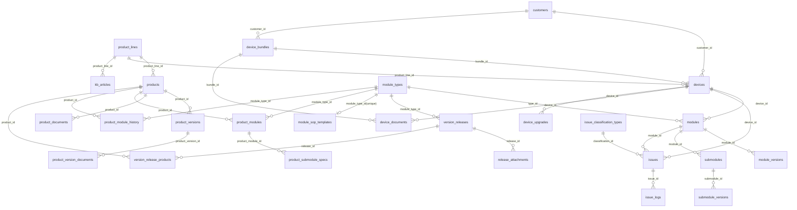

# 数据库 ER 关系图（开发版）

更新时间：2026-05-25  
适用库：device_management

## 1. 说明

- 本文档面向开发，重点展示实体关系、主外键方向和关键约束。
- 关系来源：server/database.js 当前建表与迁移逻辑。
- 全量业务表：29 张。

## 2. ER 总图（Mermaid）

## 3. 领域分层关系

### 3.1 产品与版本域

- product_lines -> products -> product_versions -> product_version_documents
- products -> product_documents
- products -> product_modules -> product_submodule_specs
- products -> product_module_history

### 3.2 设备与模块域

- customers -> devices
- device_bundles -> devices
- devices -> modules -> module_versions
- modules -> submodules -> submodule_versions
- module_types 同时关联 modules、version_releases、product_modules、product_module_history、module_sop_templates

### 3.3 版本发布域

- version_releases -> release_attachments
- version_releases <-> products 通过 version_release_products 建立多对多

### 3.4 售后与知识库域

- devices/modules -> issues
- issue_classification_types -> issues
- issues -> issue_logs
- product_lines -> kb_articles

### 3.5 飞书通知域（弱耦合）

- feishu_config、feishu_users、feishu_notifications 为集成表。
- 其中 feishu_notifications 使用业务 ref_id 关联业务记录（逻辑关联），不走数据库外键。

## 4. 关键约束与实现要点

1. devices.id 与 issues.id 均为 VARCHAR 主键风格（历史迁移后）。
2. modules 存在唯一约束 unique_device_module(device_id, type_id)，保证单设备单类型唯一模块实例。
3. module_sop_templates.module_type_id 唯一，表示模块类型与 SOP 模板一对一。
4. product_versions 存在唯一约束 unique_product_version(product_id, version_number)。
5. version_release_products 存在唯一约束 uq_release_product(release_id, product_id)。
6. product_module_history 存在唯一约束 unique_version(product_id, module_type_id, version_number)。
7. version_releases.source 区分 manual 与 synced，便于区分人工发布与型号同步发布。
8. device_documents 允许 device_id 为空并通过 bundle_id 挂组合级文档。

## 5. 表清单（按域）

### 产品体系

- product_lines
- products
- product_versions
- product_version_documents
- product_documents

### 设备管理

- devices
- device_bundles
- device_documents
- device_upgrades

### 模块与版本

- module_types
- modules
- module_versions
- module_sop_templates
- submodules
- submodule_versions

### 产品模块配置

- product_modules
- product_submodule_specs
- product_module_history

### 版本发布库

- version_releases
- release_attachments
- version_release_products

### 客户与售后

- customers
- issues
- issue_logs
- issue_classification_types

### 知识库

- kb_articles

### 飞书集成

- feishu_config
- feishu_users
- feishu_notifications
