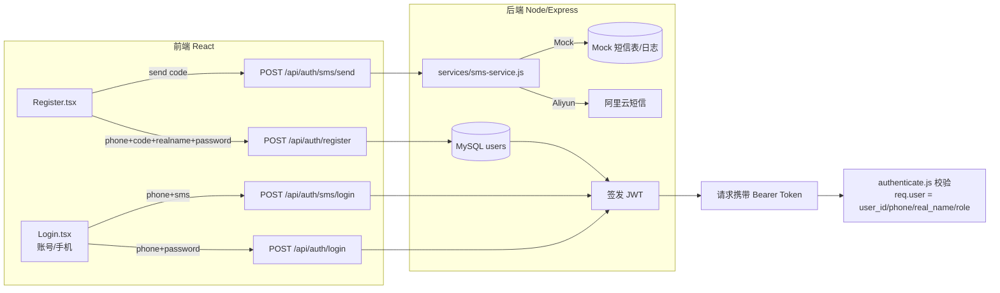

# 注册登录 + 手机验证码 + 实名绑定 — 技术设计

> 所属变更：`add-phone-auth`
> 目标：为售后登记系统引入「手机号 + 短信验证码」注册登录，并将手机号与真实姓名强绑定，作为操作人身份标识。

---

## 1. 目标与背景

### 1.1 现状
- 登录使用 `server/routes/auth.js`，依赖环境变量 `LOGIN_USERNAME` / `LOGIN_PASSWORD`，单一账号，角色仅 `admin` / `user`。
- JWT payload 仅含 `{ username, role }`，`middleware/authenticate.js` 校验 Bearer Token。
- 数据库**没有** `users` 表；`issues` 的 `assignee`、`device_documents.uploaded_by`、`kb_articles.created_by`、`issue_logs.operator` 等均为自由文本，无法与真实人员绑定。
- 系统已使用阿里云 OSS（`ali-oss`），属于阿里云生态。

### 1.2 目标
1. 支持**手机号 + 短信验证码**注册。
2. 注册时强制绑定**真实姓名**（必填），作为操作人身份。
3. 登录支持「手机号 + 密码」与「手机号 + 验证码」两种方式，并保留原「用户名 + 密码」兼容。
4. 通过 JWT 将 `user_id / phone / real_name / role` 注入请求，供后续业务记录绑定负责人。
5. 短信服务抽象（阿里云生产 / Mock 开发），可一键切换。

---

## 2. 总体方案



### 2.1 核心流程：注册
1. 用户输入手机号 → 点击「获取验证码」→ `POST /api/auth/sms/send`（携带 `phone`, `purpose=register`）。
2. 后端校验手机号格式、是否已注册、冷却时间，生成 6 位随机码，写入 `sms_codes` 表，通过 `sms-service` 发送（Mock 模式回写日志/响应提示）。
3. 用户填写**验证码 + 真实姓名 + 密码** → `POST /api/auth/register`。
4. 后端校验验证码（未过期、未使用、用途匹配），校验真实姓名长度，`bcrypt` 加密密码，写入 `users`（`status` 由配置决定，见 7.1）。
5. 注册成功 → 默认直接签发 JWT 完成登录（`auto_login` 可选），或跳转被动登录。

### 2.2 核心流程：登录
- **手机号 + 密码**：`POST /api/auth/login`，校验 `users.password_hash`，签发 JWT。
- **手机号 + 验证码**：`POST /api/auth/sms/login`，校验一次性验证码，签发 JWT。
- **用户名 + 密码（兼容）**：`POST /api/auth/login`，若未匹配到 `users` 则回退到旧的 `LOGIN_USERNAME`/`LOGIN_PASSWORD` 判定，保持现有管理员可用。

---

## 3. 数据库设计

### 3.1 `users` 表

```sql
CREATE TABLE IF NOT EXISTS users (
  id INT AUTO_INCREMENT PRIMARY KEY,
  phone VARCHAR(20) NOT NULL,
  real_name VARCHAR(50) NOT NULL COMMENT '真实姓名',
  password_hash VARCHAR(255) DEFAULT NULL COMMENT 'bcrypt 密码哈希',
  role ENUM('admin','user','pending') NOT NULL DEFAULT 'pending' COMMENT '角色',
  status TINYINT(1) NOT NULL DEFAULT 0 COMMENT '0=待审核(restricted) 1=启用 2=禁用',
  created_at TIMESTAMP DEFAULT CURRENT_TIMESTAMP,
  updated_at TIMESTAMP DEFAULT CURRENT_TIMESTAMP ON UPDATE CURRENT_TIMESTAMP,
  UNIQUE KEY uk_phone (phone)
) ENGINE=InnoDB DEFAULT CHARSET=utf8mb4 COLLATE=utf8mb4_unicode_ci;
```

说明：
- `phone` 唯一，作为登录主标识。
- `real_name` 为**必填**，实名绑定核心字段。
- `role = 'pending'` 用于"注册后需管理员审核"模式；若开启"开放注册",可默认 `role='user', status=1`。
- `status` 用于冻结/禁用账号。

### 3.2 `sms_codes` 表

```sql
CREATE TABLE IF NOT EXISTS sms_codes (
  id INT AUTO_INCREMENT PRIMARY KEY,
  phone VARCHAR(20) NOT NULL,
  code VARCHAR(6) NOT NULL,
  purpose ENUM('register','login','reset') NOT NULL DEFAULT 'register' COMMENT '用途',
  expires_at TIMESTAMP NOT NULL COMMENT '过期时间(默认5分钟)',
  used TINYINT(1) NOT NULL DEFAULT 0 COMMENT '是否已使用',
  attempts INT NOT NULL DEFAULT 0 COMMENT '校验失败次数(防爆破)',
  created_at TIMESTAMP DEFAULT CURRENT_TIMESTAMP,
  INDEX idx_phone_purpose (phone, purpose),
  INDEX idx_expires (expires_at)
) ENGINE=InnoDB DEFAULT CHARSET=utf8mb4 COLLATE=utf8mb4_unicode_ci;
```

说明：
- 验证码单次有效，`used=1` 后不可复用。
- `attempts` 用于防爆破（如失败 5 次作废）。
- 每次发送前将同 phone+purpose 的旧码标记为已使用/过期。

---

## 4. 后端设计

### 4.1 短信服务层 `server/services/sms-service.js`

> 抽象风格参照 `services/feishu-service.js`：通过环境变量在 Mock 与真实短信之间切换，上层路由不感知实现。

```js
// 伪代码结构
const provider = (process.env.SMS_PROVIDER || 'mock').toLowerCase();

async function sendSmsCode({ phone, code, purpose }) {
  if (provider === 'aliyun') {
    // 调用阿里云短信 SDK
  } else {
    // Mock：写日志 + 可回落 response 提示 / 写入 mock-inbox 表
  }
}
```

- 环境变量：
  - `SMS_PROVIDER=mock|aliyun`
  - `SMS_MOCK_MODE=true`（本地调试时验证码可在响应中带回或查询 mock 收件箱）
  - `SMS_ACCESS_KEY_ID` / `SMS_ACCESS_KEY_SECRET`（复用 OSS 同套 AccessKey）
  - `SMS_SIGN_NAME=售后登记系统`
  - `SMS_TEMPLATE_CODE=SMS_xxxxx`
  - `SMS_CODE_TTL_MINUTES=5`
  - `SMS_RESEND_SECONDS=60`

### 4.2 认证路由 `server/routes/auth.js`（扩展）

| 方法 | 路径 | 说明 | 鉴权 |
|---|---|---|---|
| POST | `/api/auth/sms/send` | 发送验证码（限流+冷却） | 公开 |
| POST | `/api/auth/register` | 注册（手机号+验证码+真实姓名+密码） | 公开 |
| POST | `/api/auth/login` | 手机号+密码 / 用户名+密码（兼容） | 公开 |
| POST | `/api/auth/sms/login` | 手机号+验证码快捷登录 | 公开 |
| GET | `/api/auth/verify` | 校验 token（保留） | 公开 |
| GET | `/api/auth/users` | 用户列表（管理员） | 需管理员 |
| POST | `/api/auth/users/:id/approve` | 审核通过（pending→user） | 需管理员 |
| POST | `/api/auth/users/:id/disable` | 启用/禁用 | 需管理员 |

#### 4.2.1 发送验证码 `sms/send`
1. 校验手机号（`^1[3-9]\d{9}$`）。
2. `express-rate-limit` 按 phone 限制（如 1 分钟/条、10 条/天）。
3. 检查同手机号 60s 冷却。
4. 若 `purpose=register` 且手机号已注册 → 返回"该手机号已注册"。
5. 生成 6 位随机码，写入 `sms_codes`，调用 `sms-service.sendSmsCode`。
6. Mock 模式下验证码写日志/收件箱，响应可 `{ success, mock_code }` 便于联调。

#### 4.2.2 注册 `register`
- 入参：`phone, code, real_name, password`。
- 校验验证码（匹配、未过期、未使用、尝试次数），校验通过置 `used=1`。
- 校验真实姓名（`2~20` 字）、密码强度（≥6 位）。
- `bcrypt.hash(password, 10)`。
- 插入 `users`，`role/status` 依据 `REGISTER_APPROVAL` 配置。
- 可选 `auto_login`：直接签发 JWT 返回。

#### 4.2.3 登录 `login`
1. 若 `phone` 匹配 `users` → 校验密码哈希，签发 JWT。
2. 否则回退旧逻辑：`username` + 环境变量密码（保留管理员）。

#### 4.2.4 JWT payload
```js
jwt.sign(
  { user_id, phone, real_name, role, username: phone },
  jwtSecret,
  { expiresIn: jwtExpiresIn }
);
```

### 4.3 认证中间件 `server/middleware/authenticate.js`
- 读取 `req.user = { user_id, phone, real_name, role }`。
- 新增 `requireAdmin`（可选）或在校验处判断 `role==='admin'`。

### 4.4 `server/index.js`
- `/api/auth` 保持公开。
- 用户管理子接口挂载：`app.use('/api/auth', authRoutes)`（内部对管理员接口用 `authenticate` + 角色判断）。
- `database.js` 的 `createTables()` 追加 `users`、`sms_codes` 建表 SQL（`CREATE TABLE IF NOT EXISTS`，零破坏）。

---

## 5. 前端设计

### 5.1 路由（`App.tsx`）
```tsx
<Route path="/register" element={<Register />} />
// /login 保持公开
```

### 5.2 注册页 `Register.tsx`
- 表单字段：手机号、验证码（带「获取验证码」按钮 + 60s 倒计时）、真实姓名、密码、确认密码。
- 交互：输入手机号 → 点获取验证码 → 后端校验后开始倒计时 → 提交注册。
- 成功后：若 `auto_login` 则写入 token 并跳转首页；否则跳转登录页。

### 5.3 登录页 `Login.tsx`（改造）
- Tab 切换：「账号登录」（用户名+密码，原逻辑）/「手机登录」（手机号 + 密码，或 手机号 + 验证码）。
- 手机登录提供「手机验证码登录」与「密码登录」两种模式。

### 5.4 认证上下文 `AuthContext.tsx`
```ts
interface AuthUser {
  id: number;
  username: string;
  phone?: string;
  realName?: string;
  role: string;
}
```
- localStorage 扩展键：`auth_user_id`、`auth_phone`、`auth_real_name`。
- `login()`、`register()`、`smsLogin()` 方法。

### 5.5 API 服务 `services/api.ts`
新增 `authApi`：
```ts
authApi = {
  sendSms: (payload) => api.post('/auth/sms/send', payload),
  register: (payload) => api.post('/auth/register', payload),
  smsLogin: (payload) => api.post('/auth/sms/login', payload),
  // login 沿用现有
};
```

### 5.6 类型 `types/index.ts`
新增 `User`、`RegisterPayload`、`SmsSendPayload`、`SmsLoginPayload` 等类型。

---

## 6. 安全与风控

| 项 | 方案 |
|---|---|
| 验证码 | 6 位数字，有效期 5 分钟，单次使用，失败 5 次作废 |
| 发送频率 | `express-rate-limit`：每手机号 1 分钟 1 条、每日 10 条 |
| 密码 | `bcrypt` 哈希，强度 ≥6 位；`password_hash` 不返回 |
| 手机号格式 | `^1[3-9]\d{9}$` |
| JWT | `JWT_SECRET` 沿用；payload 不存敏感信息（仅 id/phone/real_name/role） |
| 实名 | `real_name` 必填、服务端校验长度与非法字符 |
| 审核 | 注册默认 `pending`，管理员审核后启用（开关可配） |
| 爆破 | 登录失败限流；`attempts` 计数 |
| 传输 | 生产走 HTTPS（现有 `https` 模块 + `ssl/`）|

---

## 7. 兼容与迁移

### 7.1 注册后是否需要管理员审核（决策点）
- **方案 A（默认，推荐）**：注册后 `status=0, role='pending'`，登录接口对 `pending` 用户返回"待审核"提示，管理员在「用户管理」中通过。
- **方案 B（开放注册）**：注册后 `status=1, role='user'`，立即可用。适合内网/受信任环境。
- 通过环境变量 `REGISTER_APPROVAL=true` 控制。

### 7.2 现有管理员账号保持可用
- 保留旧 `LOGIN_USERNAME` / `LOGIN_PASSWORD` 判定作为兼容分支，避免影响现有使用。
- 可额外提供"将 env 管理员同步进 `users` 表"的初始化脚本（`seedAdmin`），便于后续完全迁移到 `users`。

### 7.3 零破坏性
- 新增表、新增接口，不修改既有业务表与既有接口返回结构。
- `users`/`sms_codes` 用 `CREATE TABLE IF NOT EXISTS`，已入库数据无影响。

---

## 8. 环境变量（`env.example` 增量）

```bash
# 短信服务
SMS_PROVIDER=mock                    # mock | aliyun
SMS_MOCK_MODE=true
SMS_ACCESS_KEY_ID=LTAI5tBExxxxxxxx
SMS_ACCESS_KEY_SECRET=xxxxxx
SMS_SIGN_NAME=售后登记系统
SMS_TEMPLATE_CODE=SMS_xxxxxxxx
SMS_CODE_TTL_MINUTES=5
SMS_RESEND_SECONDS=60

# 认证
REGISTER_APPROVAL=true               # true=注册后需管理员审核
AUTO_LOGIN_AFTER_REGISTER=true       # 注册成功后自动登录
```

---

## 9. 待确认决策点

1. **短信服务商**：默认按阿里云短信设计（与现有 OSS 同一云厂商）。是否改用其它服务商？
2. **注册审核**：默认方案 A（需管理员审核）。是否需要开放注册（方案 B）？
3. **登录方式**：是否需要「手机号+验证码」快捷登录，还是仅「手机号+密码」？
4. **是否绑定密码**：注册是否必须设置密码（便于后续手机号+密码登录），还是以验证码登录为主？
5. **现有管理员接入**：是否将现有 env 管理员同步进 `users` 表，逐步替代 env 登录？

确认后即可按 `tasks.md` 进入实现。
