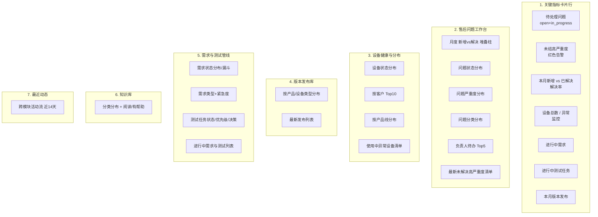

# 仪表盘重构方案 — 运营驾驶舱

> 所属变更：`refactor-dashboard`
> 目标：把「设备中心」导向的仪表盘，重构为能指导日常工作的**运营驾驶舱**。
> 分析基于：`server/database.js` 全部 29+ 张业务表 + 真实数据行数抽样（2026-09-08）。

---

## 一、现状诊断：为什么数据"没有实用性"

### 1.1 当前仪表盘呈现的指标

| 卡片/图 | 数据来源 | 问题 |
|---|---|---|
| 设备总数 | `devices` | 有信息量，但孤零零 |
| 待解决问题 | `issues status != closed` | 有用，但未区分严重度/超期/负责人 |
| **版本类型** | `COUNT(DISTINCT version_type)` | **恒为 2（factory/update），无信息量** |
| **本月已解决** | `status='closed' AND DATE(updated_at) >= 30天` | **口径错误**：用 `updated_at` 而非 `resolved_at`；是滚动 30 天而非自然月 |
| 设备状态分布 | `devices.status` | 有用，但现状仅 `使用中(正常)/已发货` 两类 |
| 问题状态/严重度分布 | `issues` | 采用英文枚举（open/in_progress/closed），未映射中文 |
| 版本类型分布 | `module_versions.version_type` | 同"版本类型"，信息量低 |
| 产品线分布 / locationStats | `devices × product_lines` | `locationStats` 实为产品线统计，**字段名误导** |
| 月度趋势 | `devices/issues/module_versions` | 仅 3 类数据，忽略需求/测试/发布 |
| 最近活动 | 设备/问题/模块版本（近7天） | 忽略需求/测试/发布/升级/知识库 |

### 1.2 真实数据量（2026-09-08 抽样）

| 表 | 行数 | 结论 |
|---|---|---|
| devices | 241 | 设备域数据充足（235 使用中正常 / 6 已发货） |
| issues | 46 | 售后问题域中等（open 15 / in_progress 8 / closed 23） |
| version_releases | **164** | **被完全忽略的高价值数据**，按产品/设备类型分布清晰 |
| module_versions | 86 | 模块版本轨迹较丰富 |
| device_bundles | 45 | 多合一设备组合 |
| customers | 87 | 客户主数据 |
| products / product_lines | 20 / 5 | 产品/产品线 |
| **device_upgrades** | **0** | **空表**，仪表盘仍保留"升级"维度 → 应弱化 |
| kb_articles | 4 | 知识库刚起步，数据少 |
| customer_requirements | 2 | 新模块，刚起步（2026-09） |
| test_tasks | 1 | 新模块，刚起步（2026-09） |
| feishu_notifications | 1 | 通知量极少 |

### 1.3 关键业务洞察（来自真实数据）

- **售后存在积压**：近 6 月问题新增（3月5 / 4月19 / 5月22）远高于同期解决（3月1 / 4月7 / 5月5），说明**新问题在积压、解决率偏低**，这是运营要盯的核心。
- **未结高严重度问题 7 个**：可以直接做成「待办红点」。
- **版本发布库 164 条**：按「产品/设备类型」分类（龙门版全车360°检测 60、底盘检测 16、轮胎侧面 15、胎纹 7、天眼云 4、基础程序 3、品牌 2、系统辅助 1、未分类 56），是最值得上仪表盘的分布轴。
- **设备升级 0 条**：不应作为主模块，占据版面。
- **需求/测试刚起步**：数据量小，宜做「管线/进行中」视图而非长期趋势。

---

## 二、重构原则

1. **行动导向**：优先呈现"需要我做什么"（待办/关注项），其次才是"发生了什么"（统计）。
2. **口径准确**：统一用 `resolved_at`、自然月、中文状态枚举。
3. **数据驱动选型**：优先展示有数据支撑的维度（版本发布、设备、售后问题），弱化空数据维度（设备升级、知识库）。
4. **可折叠**：保留现有折叠分区，避免页面过长。
5. **零破坏**：不改数据库；`/api/dashboard/stats` 结构变更，前端同步适配。

---

## 三、新仪表盘布局（运营驾驶舱）



### 各区块内容与数据源

| 区块 | 展示 | 数据表 |
|---|---|---|
| ①KPI | 待处理问题 / 未结高严重度 / 本月新增vs解决 / 设备总数与异常 / 进行中需求 / 进行中测试 / 本月版本发布 | issues、devices、customer_requirements、test_tasks、version_releases |
| ②售后问题 | 新增vs解决堆叠、状态/严重度/分类分布、负责人待办Top、最新高严重度清单 | issues、issue_logs（解决时长）、issue_classification_types |
| ③设备健康 | 状态分布、按客户/产品线、异常设备清单 | devices、customers、product_lines、device_bundles |
| ④版本发布 | 按产品/设备类型分布、最新发布 | version_releases、module_types、products |
| ⑤需求/测试管线 | 需求状态/类型/紧急度、测试状态/优先级/决策、进行中列表 | customer_requirements、test_tasks |
| ⑥知识库 | 分类分布、阅读/有帮助、置顶 | kb_articles |
| ⑦最近动态 | 跨模块活动流（近14天） | 上述各表 + feishu_notifications |

---

## 四、后端重构（`server/routes/dashboard.js`）

保持单接口 `/api/dashboard/stats`，返回结构化数据；建议后续若超时再拆 `/api/dashboard/activity`。

### 4.1 新返回结构（`DashboardStats`）

```js
{
  kpi: {
    open_issues,                     // open + in_progress
    high_open_issues,                // status!='closed' AND severity='high'
    issues_created_this_month,       // 自然月 created_at
    issues_resolved_this_month,      // 自然月 resolved_at
    resolve_rate_this_month,         // resolved / created
    total_devices,
    abnormal_devices,                // status='使用中(异常)'
    active_requirements,             // 需求 status NOT IN (已发布,废弃)
    active_tasks,                    // 测试 status IN (测试中,已测试)
    releases_this_month
  },
  issueMonthly: [{ month, created, resolved }],   // 近12月 新增vs解决
  issueStatusDistribution,      // [{status,count}] 中文
  issueSeverityDistribution,    // [{severity,count}]
  issueCategoryDistribution,    // [{category,count}] 硬件/软件/安装调试/其他
  assigneeWorkload,             // [{assignee, open_count}] Top5
  latestHighIssues,             // [{id,description,device,severity,created_at}] 最新未解决高严重度
  avgResolutionHours,           // closed 平均解决时长
  deviceStatusDistribution,     // [{status,count}]
  deviceCustomerDistribution,   // [{customer,count}] Top10
  deviceProductLineDistribution,// [{line,count}]
  abnormalDevices,              // [{id,name,customer}] 清单
  releaseCategoryDistribution,  // [{category,count}] version_releases
  latestReleases,               // [{version_number,title,category,release_date}] Top10
  requirementStatusDistribution,// [{status,count}]
  requirementTypeDistribution,  // [{type,count}]
  requirementUrgencyDistribution,// [{urgency,count}]
  taskStatusDistribution,       // [{status,count}]
  taskPriorityDistribution,     // [{priority,count}]
  taskDecisionDistribution,     // [{decision,count}]
  kbCategoryDistribution,       // [{category,count,views,helpful}]
  recentActivities              // 跨模块 近14天
}
```

### 4.2 关键 SQL 示例

**① KPI（修正口径）**
```sql
-- 待处理问题
SELECT COUNT(*) c FROM issues WHERE status IN ('open','in_progress');
-- 未结高严重度
SELECT COUNT(*) c FROM issues WHERE status!='closed' AND severity='high';
-- 本月新增（自然月）
SELECT COUNT(*) c FROM issues WHERE YEAR(created_at)=YEAR(CURDATE()) AND MONTH(created_at)=MONTH(CURDATE());
-- 本月已解决（用 resolved_at，非 updated_at）
SELECT COUNT(*) c FROM issues WHERE status='closed' AND YEAR(resolved_at)=YEAR(CURDATE()) AND MONTH(resolved_at)=MONTH(CURDATE());
-- 平均解决时长
SELECT ROUND(AVG(TIMESTAMPDIFF(HOUR, created_at, resolved_at)),1) h FROM issues WHERE status='closed' AND resolved_at IS NOT NULL;
```

**② 月度 新增vs解决（堆叠柱）**
```sql
SELECT m.month,
  COALESCE(created.c,0) created,
  COALESCE(resolved.c,0) resolved
FROM (SELECT DATE_FORMAT(CURDATE() - INTERVAL n MONTH,'%Y-%m') month FROM ... ) m
LEFT JOIN (SELECT DATE_FORMAT(created_at,'%Y-%m') month, COUNT(*) c FROM issues GROUP BY 1) created ON created.month=m.month
LEFT JOIN (SELECT DATE_FORMAT(resolved_at,'%Y-%m') month, COUNT(*) c FROM issues WHERE resolved_at IS NOT NULL GROUP BY 1) resolved ON resolved.month=m.month
ORDER BY m.month;
```

**③ 负责人待办 Top5**
```sql
SELECT COALESCE(NULLIF(assignee,''),'未分配') assignee, COUNT(*) open_count
FROM issues WHERE status!='closed' GROUP BY assignee ORDER BY open_count DESC LIMIT 5;
```

**④ 问题分类分布**（issues 无独立 category 枚举列，按 `classification_name` 或 desc 归类）
```sql
SELECT COALESCE(NULLIF(ic.name,''),'其他') category, COUNT(*) count
FROM issues i LEFT JOIN issue_classification_types ic ON i.classification_id=ic.id
GROUP BY ic.name ORDER BY count DESC;
```

**⑤ 版本发布库分布（高价值）**
```sql
SELECT COALESCE(NULLIF(category,''),'未分类') category, COUNT(*) count
FROM version_releases GROUP BY category ORDER BY count DESC;
```

**⑥ 需求状态 / 类型 / 紧急度**
```sql
SELECT status, COUNT(*) c FROM customer_requirements GROUP BY status;
SELECT requirement_type, COUNT(*) c FROM customer_requirements GROUP BY requirement_type;
SELECT urgency, COUNT(*) c FROM customer_requirements GROUP BY urgency;
```

**⑦ 测试任务状态 / 优先级 / 决策**
```sql
SELECT status, COUNT(*) c FROM test_tasks GROUP BY status;
SELECT priority, COUNT(*) c FROM test_tasks GROUP BY priority;
SELECT upgrade_decision, COUNT(*) c FROM test_tasks GROUP BY upgrade_decision;
```

**⑧ 设备健康**
```sql
-- 状态分布
SELECT status, COUNT(*) c FROM devices GROUP BY status;
-- 按客户 Top10
SELECT COALESCE(c.name,'未指定') customer, COUNT(*) c FROM devices d
LEFT JOIN customers c ON d.customer_id=c.id GROUP BY d.customer_id ORDER BY c DESC LIMIT 10;
-- 异常设备清单
SELECT d.id, d.name, COALESCE(c.name,'未指定') customer FROM devices d
LEFT JOIN customers c ON d.customer_id=c.id WHERE d.status='使用中(异常)';
```

**⑨ 最近动态（跨模块，近14天）**
```sql
SELECT 'issue' type, id, LEFT(description,50) name, created_at ts, CONCAT('问题创建 - ',severity) action FROM issues WHERE created_at>=DATE_SUB(NOW(),INTERVAL 14 DAY)
UNION ALL
SELECT 'requirement', id, req_code, created_at, CONCAT('需求登记 - ', requirement_type) FROM customer_requirements WHERE created_at>=DATE_SUB(NOW(),INTERVAL 14 DAY)
UNION ALL
SELECT 'task', id, task_code, created_at, CONCAT('测试任务 - ', status) FROM test_tasks WHERE created_at>=DATE_SUB(NOW(),INTERVAL 14 DAY)
UNION ALL
SELECT 'release', id, version_number, created_at, '版本发布' FROM version_releases WHERE created_at>=DATE_SUB(NOW(),INTERVAL 14 DAY)
UNION ALL
SELECT 'upgrade', id, descr, created_at, '设备升级' FROM device_upgrades WHERE created_at>=DATE_SUB(NOW(),INTERVAL 14 DAY)
ORDER BY ts DESC LIMIT 30;
```

> 说明：动态流用 `UNION ALL` 时注意各子查询字段对齐；若性能敏感可拆为独立 `/api/dashboard/activity` 接口并分页。

---

## 五、前端重构（`client/src/pages/Dashboard.tsx`）

### 5.1 布局

1. **KPI 卡片行**：`StatsCard` 复用，新增红/黄告警色。7 张卡片。
2. **售后问题工作台**：2 列栅格堆叠柱（新增vs解决）+ 状态/严重度/分类分布 + 负责人待办条 + 最新高严重度清单（列表，点击跳转 issue 详情）。
3. **设备健康**：状态饼图 + 按客户/产品线条形 + 异常设备清单。
4. **版本发布库**：按产品/设备类型分布（条形/饼）+ 最新发布列表。
5. **需求与测试管线**：需求状态分布 + 类型/紧急度 + 测试状态/优先级/决策 + 进行中列表。
6. **知识库**：分类分布 + 阅读/有帮助（数据少，可折叠）。
7. **最近动态**：活动流（复用现有 recent activity 组件，扩展 type 映射）。

### 5.2 组件复用与新增

- 复用：`StatsCard`、`ChartCard`、`ProductLineChart`、`Badge`、`Card`、`Button`。
- 新增：
  - `StackedBarChart`（月度 新增vs解决）
  - `AssigneeWorkloadList`（负责人待办）
  - `HighPriorityIssueList`（高严重度待办，可点击跳转）
  - `ActionList`（通用"关注项"列表，用于异常设备/进行中需求/测试）

### 5.3 类型同步

- `client/src/types/index.ts`：重定义 `DashboardStats` 为新结构。
- `client/src/services/api.ts`：`dashboardApi.getStats()` 映射新结构。

### 5.4 交互与响应式

- 沿用 `useIs1080p()` 调整图表高度。
- KPI 卡片在窄屏自动换行。
- 所有分区保留折叠按钮；默认展开 KPI、问题工作台、设备健康、版本发布，折叠需求/测试、知识库。

---

## 六、环境与兼容

- **数据库**：无变更。
- **API**：`/api/dashboard/stats` 结构变更（前端同步），不影响其它接口；可选新增 `/api/dashboard/activity`。
- **删除项**：`version_types` 指标、`module_versions` 版本类型图（信息量低）、`locationStats` 误导字段。
- **弱化项**：设备升级（0 数据）、知识库（数据少，折叠）。

---

## 七、待确认决策点

1. **接口拆分**：保持单一 `/stats` 还是拆 `/activity`（动态流分页）？建议拆。
2. **问题分类轴**：`issues` 用 `classification_id`（issue_classification_types）还是按 `description` 规则归类？建议用 classification。
3. **KPI 卡片数量**：7 张是否偏多？可收敛为 4 主 + 3 次。
4. **是否保留打印版**：现有打印功能是否保留并覆盖新布局？
5. **设备升级**：既然 0 数据，是否干脆从仪表盘移除该分区？

确认后即可按 `tasks.md` 实施。
